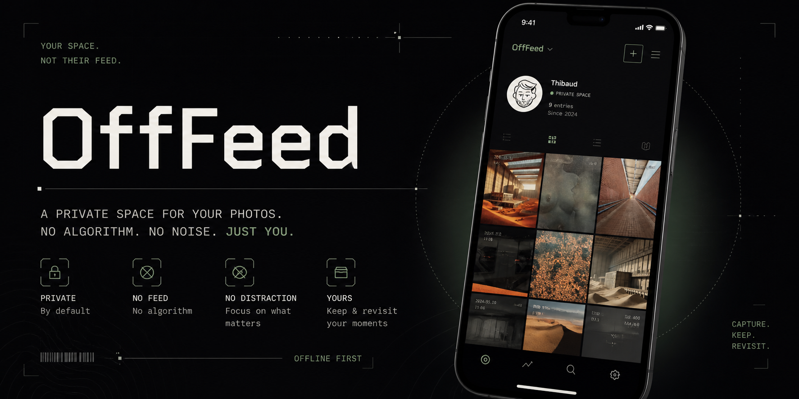

<p align="center">
  
</p>

*[Français](README.md)*

# OffFeed

**OffFeed** is a minimal, Instagram-inspired interface focused solely on your own content.

The project starts from a simple observation: posting a photo has become inseparable from a crowded environment. Using Instagram today is no longer just about creating and sharing — it also means scrolling an endless feed of posts, suggestions, and sponsored content. Over time, that context has overshadowed the act itself.

---

## Intention

OffFeed is not trying to replace Instagram. It tries to isolate one specific part of it: **the experience of publishing and viewing your own content** — without everything else.

---

## Concept

The app is deliberately limited:

- access to your profile and photo grid  
- publishing and editing content  
- editing your profile (bio, image)  
- **no** external feed, stories, DMs, or recommendations  

The UI follows familiar Instagram profile patterns but strips away what pulls your attention elsewhere.

---

## Instagram integration (optional)

You can connect an Instagram account using access tokens (Instagram Graph API) to:

- publish from OffFeed  
- mirror posts to Instagram  

You can keep your public presence updated without living inside the mobile app’s feed.

---

## Positioning

This is not about rejecting sharing — it’s about the context sharing happens in today. OffFeed offers a space where your content stands alone, while still being shareable elsewhere.

---

## What the app does (technical)

- **Public wall** — Instagram-style grid at `/`, public or password-protected  
- **Post detail** — `/p/[id]` with caption, tags, and date  
- **Admin** — `/admin`: create, edit, and delete posts  
- **Archive import** — upload an Instagram export (ZIP) to rebuild your history locally  
- **Publish to Instagram** — optional, per post, via the Graph API  

---

## Stack

- [Next.js 14](https://nextjs.org) (App Router, API routes)  
- [SQLite](https://www.sqlite.org) + [Prisma](https://www.prisma.io)  
- [NextAuth.js](https://next-auth.js.org)  
- [Tailwind CSS](https://tailwindcss.com)  
- [sharp](https://sharp.pixelplumbing.com) — image processing  
- [adm-zip](https://github.com/cthackers/adm-zip) — ZIP import  

---

## Installation

### Prerequisites

- Node.js 18 or newer  
- npm (or pnpm / yarn)  

### 1. Clone the repository and install dependencies

```bash
git clone https://github.com/YOUR_USER/YOUR_REPO.git
cd YOUR_REPO
npm install
```

(Replace the URL and folder with your fork or repository.)

### 2. Environment variables

```bash
cp .env.example .env.local
```

Edit `.env.local`:

- **`NEXTAUTH_URL`** — local: `http://localhost:3000`; production: your public site URL  
- **`NEXTAUTH_SECRET`** — long random secret (in production, at least 32 characters)  

```bash
openssl rand -base64 32
```

- **`DATABASE_URL`** — default: `file:./dev.db` (SQLite file next to the Prisma schema; in practice `prisma/dev.db` under the project root)  

Instagram keys (`INSTAGRAM_*`) are **optional** until you use “publish to Instagram”.

> The admin password is **not** in `.env`: it is set on first launch (see step 5).

### 3. Database

```bash
npx prisma db push
npm run db:seed
```

### 4. Start the development server

```bash
npm run dev
```

Open [http://localhost:3000](http://localhost:3000) for the public wall and [http://localhost:3000/admin](http://localhost:3000/admin) for the admin area.

### 5. First-time setup

1. Go to `/admin`: you are redirected to **`/admin/setup`** to create the admin password.  
2. Sign in, then **enable 2FA** (TOTP) from the admin UI — it is required to access the dashboard.  

---

## Usage

### Import an Instagram archive

1. On Instagram: **Settings → Your activity → Download your information** — request a JSON export (ZIP).  
2. In admin: **Import** — upload the ZIP.  
3. Photos and captions are stored locally under `public/uploads/`.  
4. Re-importing is safe: duplicates are skipped.  

### Create a post manually

**Admin → New post**: image, caption, tags.

### Publish to Instagram (optional)

Configure tokens under **Admin → Settings**, then use the publish action on a post (single image or carousel).

### Public / private site

In **Admin → Settings**, uncheck **Site is public** to password-protect the entire wall via the admin login flow.

---

## npm scripts

| Command | Description |
|---------|-------------|
| `npm run dev` | Development server |
| `npm run build` | Production build |
| `npm run start` | Production server |
| `npm run db:push` | Apply Prisma schema to the database |
| `npm run db:migrate` | Prisma migrations |
| `npm run db:studio` | Prisma Studio |
| `npm run db:seed` | Default settings values |

---

## Deployment

The app runs on any Node.js host (VPS, [Railway](https://railway.app), [Coolify](https://coolify.io), etc.).

**Production checklist**

- `NODE_ENV=production`  
- `NEXTAUTH_URL` = public URL  
- Persist **`public/uploads/`** and the SQLite file (`DATABASE_URL`)  

In containers, mount volumes for those paths.

---

## Repository layout

```
src/
├── app/
│   ├── page.tsx                  # Public wall
│   ├── p/[id]/page.tsx           # Post detail
│   ├── admin/                    # Admin, setup, import, settings…
│   └── api/                      # Posts, upload, import, settings, Instagram…
├── components/
└── lib/                          # prisma, auth, settings, Instagram…
prisma/
└── schema.prisma
docs/
└── banner.png                    # README banner (GitHub)
```

---

## License

MIT
